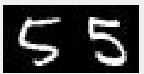

# Radon Barcode - Content Based Image Retrieval

Image search via Radon Barcode projections
Barcode 

## Overview
The generation of a barcode to represent images has many practical
applications, both in image representation as well as search queries based on
an image. A Radon barcode is a type of barcode designed to represent the
contents of an image in a simplified yet comprehensive form. This barcode can
then be used to conduct searches based on an image, finding images that have
been found to produce similar barcodes. The use of a barcode to conduct the
search over other commonly used alternatives, such as those that look for
commonly occurring shapes in the content of an image, can be advantageous due
to the speed at which barcodes can be searched.

## Team members
- Abbas Rizvi
- MohammadHamza Asif
- Shahzabe Mahmood
- Jad Eletry

## Functionality

The Radon Barcode application functions through three main methods.

The generate barcode method reads in an image and creates a barcode to
represent the data within the image. This is done through applying several
transformations and converting each row into a binary number.

After barcodes are generated for each image, the barcodes are then put through
a search function against other barcodes in the dataset and verifies if the
search resulted in the same number being found. The successes are tallied and
used to create a metric regarding the accuracy.



For this dataset the accuracy is 65%, however this can be improved at the cost
of run time.

## Applications
Radon barcode technology can be used in many different places to provide fast
and efficient querying of large amounts of data. While not as accurate as
modern AI models, it can still be tuned to perform better and will be able to
better scale with further training and refinement.


## Installation

#### Dependencies
```
python 3.10
```

#### Installation Steps
1. Clone and enter the repository

```
$ git clone https://github.com/abbas-rizvi/RadonBarcode.git
$ cd RadonBarcode
```

2. Extract MNIST dataset

Extract MNIST_DS.zip file into directory

3. Install Requirements
Install dependencies from requirements.txt using pip

```
$ pip install -r requirements.txt
```
4. Run radon.py

```
$ python radon.py
```
